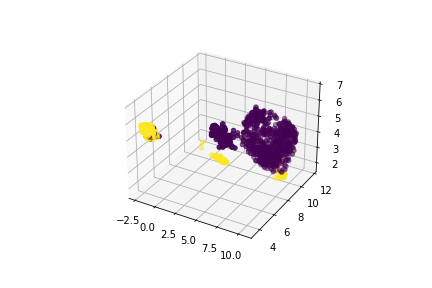

# OCTID_TF2

Unofficial implementation of 2021 Bioinformatics Paper "OCTID: a one-class learning-based Python package for tumor image detection" https://academic.oup.com/bioinformatics/article-abstract/37/21/3986/6290709?redirectedFrom=fulltext&login=false

Tensorflow 2.0 Version

Pipeline: dataset splitting --> feature extraction from ImageNet pre-trained models --> UMAP for dimensionality reduction --> OC-SVM

In this demo case, I use mobilenet as the backbone model: https://www.tensorflow.org/api_docs/python/tf/keras/applications/mobilenet/MobileNet

Some hyper-parameters can be fine-tunned for better performance, like n_neighbors and min_dist in UMAP, nu in OC-SVM. Please Note, tunning OC-SVM 'nu' is more effective than tunning other hyper-parameters.

Some factors influence the final performance:
1. backbone selection
2. inputs image resolution
3. hyper-parameters

UMAP documents: https://umap-learn.readthedocs.io/en/latest/index.html

sci-kit learn OC-SVM documents: https://scikit-learn.org/stable/modules/generated/sklearn.svm.OneClassSVM.html

OCTID PyPI package: https://pypi.org/project/octid/

OCTID official github demo: https://github.com/LitaoYang-Jet/OCTID

Dataset I use in this demo:
1. Histological images for tumor detection in gastrointestinal cancer: https://zenodo.org/record/2530789#.Yhve3htyY5l
2. LC25000 Lung and colon histopathological image dataset: https://academictorrents.com/details/7a638ed187a6180fd6e464b3666a6ea0499af4af

Histological Lung images visualization after UMAP

Please Note: when you use weights-fixed ImageNet pre-trained feature extractor, inputs(range 0-255) should not divide 255.

